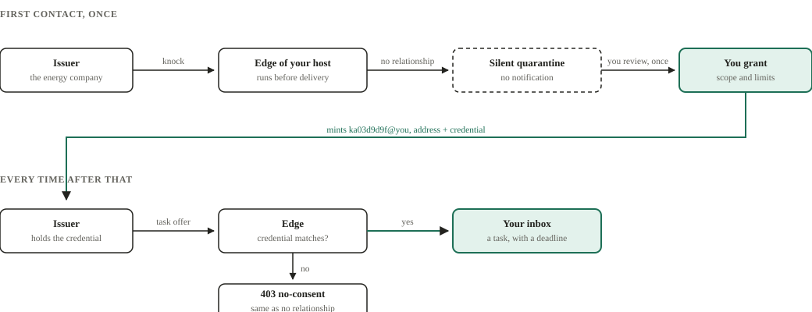
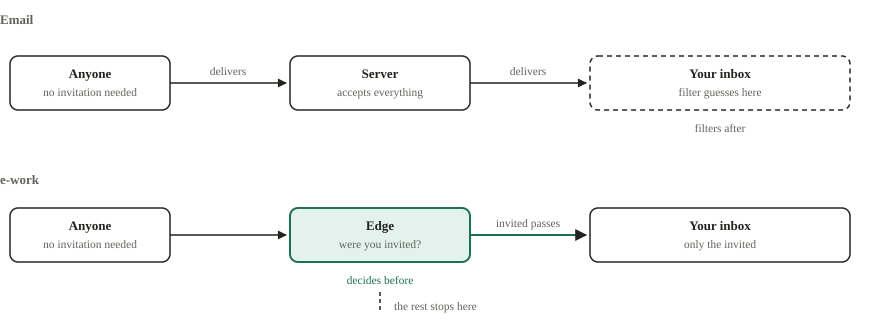
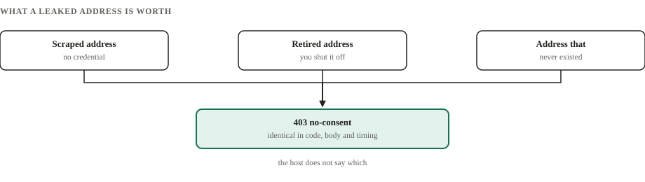
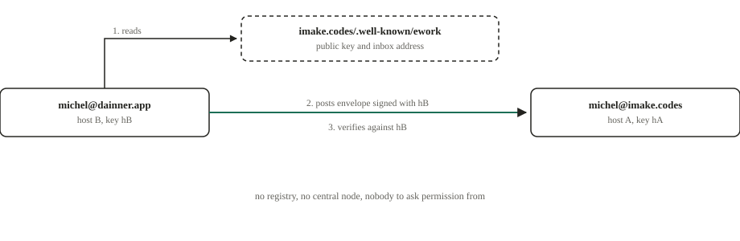

# e-work

> An open, federated, end-to-end encrypted protocol for the tasks of real life.
> What email did for messages, e-work wants to do for tasks.

**Status:** draft specification. A reference implementation runs on two
federating domains. Nothing here is frozen, and the open questions are written
down rather than hidden.

---

## The problem, in one sentence

Most of an ordinary person's tasks are not born with them. The bill is born at
the utility company, the appointment at the clinic, the delivery schedule across
four suppliers who never talk to each other. They arrive as email, as a text
message, as a PDF, and **none of those formats knows what a deadline is**. You
are the human adapter between whoever issued the task and your task list.

There is a format for messages (email), for calendar events (iCalendar) and for
contacts (vCard). There is none for a task that crosses organisations.

## The core idea: consent before delivery

Almost every messaging protocol delivers first and repairs afterwards. e-work
reverses the order: nobody puts a task in your inbox without prior, scoped and
revocable consent. This is not a setting buried in a menu, it is a rule of the
protocol.

<picture>
  <source media="(prefers-color-scheme: dark)" srcset="assets/consent-dark.svg">
  
</picture>

The first contact from a stranger reaches a silent quarantine, never your inbox.
Granting consent mints an address and a credential that exist only for that
relationship. From then on their offers pass the edge without asking again.

## Why this is not just another spam filter

The obvious objection is that consent before delivery is a good spam filter by
another name. It is not, and the difference is *where* the decision happens.

<picture>
  <source media="(prefers-color-scheme: dark)" srcset="assets/where-the-defence-runs-dark.svg">
  
</picture>

A filter guesses after accepting, and it errs in both directions. Both errors are
yours: the false positive hides the message from your child's school, the false
negative interrupts your day. The consent edge guesses nothing, because the rule
is yours and was written beforehand.

## The leaked address that is worth nothing

Every counterparty gets an address of its own. If a company's records leak, what
leaked is the address for that one relationship. You switch it off without
telling anyone and without touching your other relationships.

<picture>
  <source media="(prefers-color-scheme: dark)" srcset="assets/leaked-address-dark.svg">
  
</picture>

If the server answered "that address was disabled" in one case and "no such
address" in another, it would be handing out an oracle: someone sweeps addresses
and learns which ones exist. So the three answers are identical, down to how long
they take, and that is **measured rather than assumed**.

## Federated like email, not like a platform

<picture>
  <source media="(prefers-color-scheme: dark)" srcset="assets/federation-dark.svg">
  
</picture>

Anyone can run their own server or use a public provider. Your identity is a key
you own; the readable address is a verifiable alias on top of it, so changing
provider does not mean losing your account. There is no registry in the middle.

## Measured, not asserted

Every security claim has a test that measures it, and the tests run against the
real server. From the run of 5 August 2026:

| What was measured | Result |
|---|---|
| Deliveries from 300 unsolicited attempts, with a leaked address | **0** |
| Items the victim has to review, regardless of N | **1** |
| Guessing an address's state from response timing (floor: 50%) | **53.7%** |
| The same test's positive control, proving it can see a real difference | **98.7%** |
| Round trips of consent, paid once per relationship | **3** |

Two real defects were found this way, one of them a genuine vulnerability: the
edge checked that an envelope *had* a credential, not that it *matched*, and 119
of 300 tasks landed with a forged one. The specification already mandated
comparison; the code did not follow. Code review missed it; measurement caught
it.

## What it is not

- Not an agile tool for software teams. Jira and Linear remain better at that.
- Not a calendar. It integrates with calendars instead of replacing them.
- Not a payment method. It carries charge data and deep links, never settlement.
- No blockchain. Decentralisation here means federated servers and user-held keys.
- Not a social network. No feed, no public discovery, no engagement metrics.

## Where to start reading

| If you want to | Read |
|---|---|
| Understand the idea and judge it | [The vision](docs/vision.md), then [consent](spec/consent.md) |
| Know what already exists and why this is not it | [The landscape](docs/prior-art.md) |
| Implement a client or a host | [The specification](spec/README.md), starting at `core` |
| Attack it | [The threat model](docs/threat-model.md), 34 adversaries with residual risks |
| See how the pieces fit | [The architecture](docs/architecture.md) |
| Know why a decision was made | [The decisions](docs/decisions/adr-0001-open-federated-protocol.md), 24 ADRs, each with the alternatives it rejected and why |
| Look up a term | [The glossary](docs/glossary.md) |
| Know what is coming | [The roadmap](ROADMAP.md) |

There is also [a paper](paper/consent-before-delivery.md) making the argument in
academic form, and [the publication path](spec/PUBLISHING.md) towards the IETF.

## Try it

Three reference hosts are public, on different domains, federating with each
other. They exist to prove that federation works between real domains and not
between two processes on one machine. Each serves the web client at `/app/`.

- <https://ework.imake.codes>
- <https://ework.dainner.app>
- <https://app.eworkprotocol.org>

The discovery document tells you everything a peer needs in order to reach a
host:

```bash
curl -s https://imake.codes/.well-known/ework | jq
```

> **No end-to-end encryption yet.** At this stage the host can read content, and
> MLS is phase 2 of the roadmap. Do not put real data in.

An overview of the protocol, with these diagrams and the technical detail, is at
<https://eworkprotocol.org>.

## Language and licence

English is the canonical language of this repository. The drafts were written in
Portuguese first for iteration speed, and this repository is generated from that
work; if you find a sentence that reads like a translation, it is, and a report
is welcome.

The specification is licensed under [CC BY-SA 4.0](LICENSE). You may implement it
freely, including in closed and commercial software: the share-alike applies to
derivatives of the *text*, not to implementations of the protocol.
