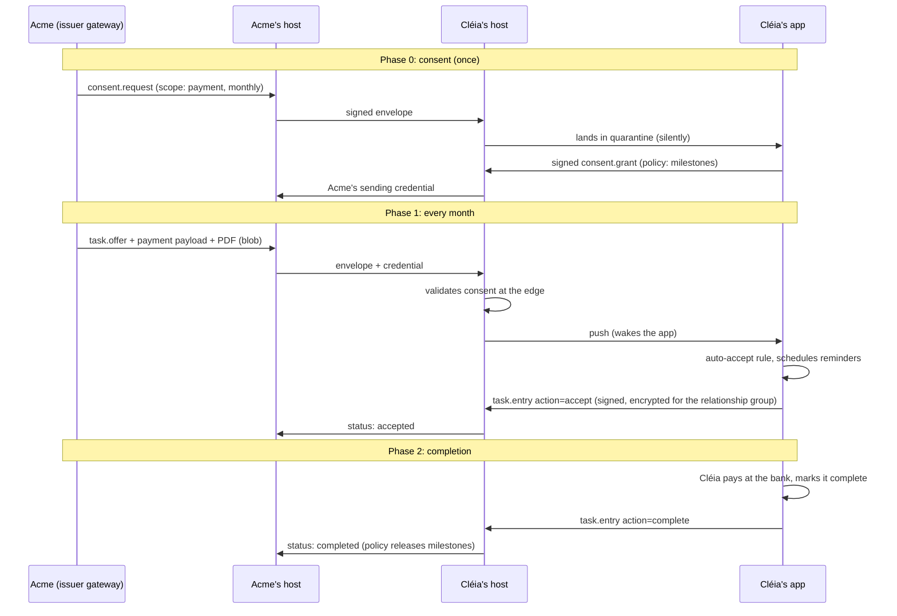
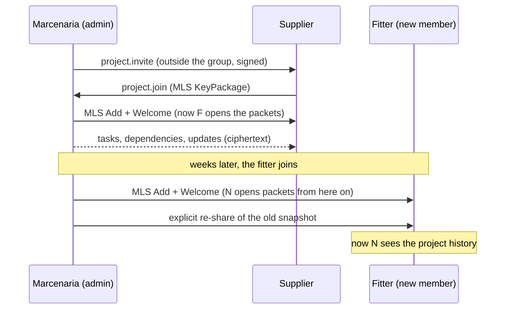

# Architecture

This document is the mental map of the system. The normative definition of each part lives in the RFCs indicated.

## 1. Layers

```
┌─────────────────────────────────────────────────────────────┐
│ L6  Extensions: typed payloads, actions, bridges, rules     │  RFC 0008, 0010
├─────────────────────────────────────────────────────────────┤
│ L5  Semantics: negotiation, consent, urgency                │  RFC 0002, 0007, 0009
├─────────────────────────────────────────────────────────────┤
│ L4  Data model: Task, Project, attachments, dependencies    │  RFC 0002
├─────────────────────────────────────────────────────────────┤
│ L3  Cryptography: MLS groups, devices, assisted mode        │  RFC 0006
├─────────────────────────────────────────────────────────────┤
│ L2  Envelopes and federation: delivery, retries, the edge   │  RFC 0001, 0005
├─────────────────────────────────────────────────────────────┤
│ L1  Identity: keys, handles, discovery                      │  RFC 0003
├─────────────────────────────────────────────────────────────┤
│ L0  Transport: HTTPS/2+, WebSocket, binary blobs, push      │  RFC 0001, 0004
└─────────────────────────────────────────────────────────────┘
```

Each layer depends only on the ones below it. A minimal client implements L0 to L4 against a single host; federation (L2 between hosts) and issuers arrive without changing the client.

## 2. Actors

- **Client:** the user's app. It holds the device keys, decrypts and encrypts content, runs local rules, computes actionability from the dependency graph, fires reminders. It can aggregate several boxes (personal, family, work) on different hosts, under the same identity.
- **Host:** hosts boxes. It persists envelopes and blobs (encrypted), keeps the synchronisation state, delivers and receives federation, applies the consent edge, wakes clients through push. In E2EE mode it does not read content; in assisted mode (opt-in per collection) it receives keys and provides extra services.
- **Issuer:** an organisation that sends offers. Anchored in a domain (key published at `/.well-known/ework/org.json`). It can run a complete host of its own or use an **issuer gateway** (a service that speaks simple REST to the company's ERP and federation to the world).
- **Escalation contact:** an identity that previously consented to receive escalations from another (RFC 0009).

There is no mandatory global directory in v0.1: discovery is by handle and domain. A directory with neutral governance is a future question recorded in RFC 0003.

## 3. Supported topologies

1. **Individual self-hosting:** one binary plus a database in a homelab, one domain. The Michel case.
2. **Family or community host:** a few dozen identities, one informal administrator.
3. **Public provider:** "the Gmail of e-work", millions of boxes, the same protocol rules, with no privilege whatsoever.
4. **Enterprise issuer:** its own host or an issuer gateway plugged into the ERP; to the rest of the network it is indistinguishable.

## 4. End-to-end flow: the bill (S1)



If consent is revoked, `HC` refuses the `task.offer` at the edge with a permanent error, and `HA` stops trying.

## 5. Group flow: the multi-supplier project (S3)

The project is an MLS group whose members are all the devices of all the participants. Every content envelope of the project is an MLS application message: the hosts route ciphertext.



Whoever leaves the group (Remove) stops opening the following packets right away: a new MLS epoch, new keys. It is exactly the "only members open the packet" model from the vision.

## 6. Transport decisions

- **Substrate:** HTTPS (HTTP/2 or better) for everything; WebSocket or SSE for real time in the foreground. No exotic ports: it crosses NAT, works in a browser and on a phone, and hosts behind any reverse proxy.
- **Envelopes:** canonical JSON (JCS) by default, signed; CBOR encoding negotiable as an optimisation (same structure, fewer bytes).
- **Attachments and blobs:** raw binary, always. Upload by PUT with the real Content-Type, download with Range (resumable), addressing by SHA-256 hash (natural deduplication), with no base64 anywhere on the data path. Base64 is tolerated only for tiny inline payloads inside objects. The reason: less overhead (base64 costs about 33%), direct disk-to-disk streaming, scale.
- **Push:** platform push (Web Push, UnifiedPush) is only an alarm clock: it wakes the client, which fetches the envelopes over the authenticated channel. Content never travels in the push. The urgency hint may travel in the clear if the user allows it (a trade-off documented in RFC 0009).

## 7. Synchronisation and conflict

- **Client to host:** the JMAP model: exact state per type (`Task/changes` since a state string), batched calls, optimistic writes with `ifInState`.
- **Multi-device E2EE:** underneath the sync, each E2EE box is an encrypted operation log (TaskChampion style): a linear chain of versions; conflicts resolve by rebasing on the client. The host orders bytes it does not read.
- **Assisted mode:** the host can merge per property and index for search. It is the same API, with more capabilities announced in the session.

## 8. Spaces and multi-tenancy

- A **space** (personal, family, work) is typically a box of its own, possibly on a host of its own. The client aggregates everything into a single view; the identity is one.
- Strong context separation (work not seeing personal, for instance) comes for free: different boxes, different cryptographic groups, different policies.
- Organisations with many employees use an organisational host; internal roles and fine-grained permissions are a product layer, not a protocol one (v0.1).

## 9. What the host sees (an honest summary)

In E2EE mode the host sees: routing addresses (from and to), envelope types, timestamps, sizes, MLS group and epoch ids, and the urgency hint when it is enabled. It does not see: titles, descriptions, payloads, attachments, internal statuses, the dependency graph. The exhaustive list and the future mitigations (padding, sender obfuscation) are in RFC 0006 and in the [threat model](threat-model.md).
